# Hotspot 项目图表集

> 仓库: `/Users/duke/Documents/hotspot`
> 文档版本: 1.0.0
> 最后更新: 2026-07-06
>
> 本文使用 Graphviz DOT 语言绘制项目关键图表,涵盖模块依赖、整体架构、数据流、类目与来源关系。

---

## 目录

1. [模块依赖图](#1-模块依赖图)
2. [项目架构图](#2-项目架构图)
3. [数据流程图](#3-数据流程图)
4. [类目与来源关系图](#4-类目与来源关系图)
5. [设计说明](#5-设计说明)

---

## 1. 模块依赖图

```dot
digraph ModuleDependency {
    rankdir=TB;
    splines=ortho;
    nodesep=0.4;
    ranksep=0.6;
    node [shape=box, style="rounded,filled", fontname="Helvetica", fontsize=11];
    edge [arrowsize=0.8];

    // 入口
    entry [label="run.py\n(uvicorn entry)", fillcolor="#0f172a", fontcolor="#ffffff"];

    // backend/main
    main [label="backend/main.py\n(FastAPI + lifespan)", fillcolor="#1e293b", fontcolor="#ffffff"];

    // 核心支撑
    subgraph cluster_support {
        label="Core Infra";
        style=filled;
        fillcolor="#f1f5f9";
        fontname="Helvetica-Bold";
        config [label="config.py\n(Settings)", shape=note, fillcolor="#fef3c7"];
        exceptions [label="exceptions.py", shape=note, fillcolor="#fef3c7"];
        cache [label="cache.py\n(3x TTLCache)", shape=note, fillcolor="#fef3c7"];
        obs [label="observability.py", shape=note, fillcolor="#fef3c7"];
        logging [label="logging_config.py", shape=note, fillcolor="#fef3c7"];
        proxy [label="proxy_*.py", shape=note, fillcolor="#fef3c7"];
    }

    // API 层
    subgraph cluster_api {
        label="API Layer (9 routers)";
        style=filled;
        fillcolor="#dbeafe";
        api_init [label="api/__init__.py\nregister_routers"];
        api_health [label="health.py"];
        api_hotspots [label="hotspots.py"];
        api_categories [label="categories.py"];
        api_trends [label="trends.py"];
        api_export [label="export.py"];
        api_proxy [label="proxy.py"];
        api_favorites [label="favorites.py"];
        api_sources [label="sources.py"];
        api_quality [label="quality.py"];
        api_mw [label="middleware.py\nTraceIDMiddleware"];
    }

    // Service 层
    subgraph cluster_services {
        label="Domain Service Layer";
        style=filled;
        fillcolor="#dcfce7";
        svc_collection [label="collection_service.py"];
        svc_hotspot [label="hotspot_service.py"];
        svc_trend [label="trend_service.py"];
        svc_export [label="export_service.py"];
    }

    // Repository 层
    subgraph cluster_repo {
        label="Repository Layer (8 repos)";
        style=filled;
        fillcolor="#e9d5ff";
        repo_db [label="db.py\n(SQLite + WAL)", fillcolor="#fde68a"];
        repo_hotspot [label="hotspot_repo.py"];
        repo_trend [label="trend_repo.py"];
        repo_fav [label="favorite_repo.py"];
        repo_quality [label="quality_repo.py"];
        repo_settings [label="settings_repo.py"];
        repo_srcstat [label="source_stats_repo.py"];
        repo_custom [label="custom_source_repo.py"];
    }

    // Collector 层
    subgraph cluster_collectors {
        label="Collector Pool (6 collectors)";
        style=filled;
        fillcolor="#fed7aa";
        col_base [label="base.py\nBaseCollector"];
        col_ai [label="ai_collector"];
        col_sec [label="security_collector"];
        col_fin [label="finance_collector"];
        col_st [label="startup_collector"];
        col_bid [label="bid_collector"];
        col_gh [label="github_collector"];
    }

    // Quality 层
    subgraph cluster_quality {
        label="Quality Gate System";
        style=filled;
        fillcolor="#fce7f3";
        q_base [label="base.py\nBaseGate"];
        q_pipe [label="pipeline.py\n9-gate orchestrator"];
        q_score [label="scorer.py"];
        q_cfg [label="config.py"];
        q_schema [label="schema_gate", shape=oval];
        q_content [label="content_quality_gate", shape=oval];
        q_cat [label="category_match_gate", shape=oval];
        q_url [label="url_validity_gate", shape=oval];
        q_rep [label="source_reputation_gate", shape=oval];
        q_title [label="title_summary_gate", shape=oval];
        q_dup [label="duplicate_gate", shape=oval];
        q_author [label="author_verification_gate", shape=oval];
        q_final [label="final_url_gate", shape=oval];
    }

    // Scheduler
    subgraph cluster_sched {
        label="Scheduler";
        style=filled;
        fillcolor="#cffafe";
        sch [label="scheduler.py"];
        sch_jobs [label="jobs.py\n(5 jobs)"];
    }

    // Domain
    subgraph cluster_domain {
        label="Domain Models";
        style=filled;
        fillcolor="#fee2e2";
        dom_models [label="models.py\nHotspotItem"];
        dom_enums [label="enums.py\nCategory"];
        dom_coll [label="collection.py"];
    }

    // Frontend
    subgraph cluster_frontend {
        label="Frontend (React + TS)";
        style=filled;
        fillcolor="#e0e7ff";
        fe_app [label="App.tsx"];
        fe_comp [label="components/\n(10 components)"];
        fe_hooks [label="hooks/\n(3 hooks)"];
        fe_types [label="types/index.ts"];
    }

    // 主入口连线
    entry -> main;
    main -> {config, exceptions, cache, obs, logging, proxy};
    main -> api_init;
    main -> sch;
    main -> repo_db;

    // API → Services
    api_init -> {api_health, api_hotspots, api_categories, api_trends, api_export, api_proxy, api_favorites, api_sources, api_quality, api_mw};
    {api_hotspots, api_categories, api_trends, api_favorites, api_export} -> svc_hotspot;
    api_trend_node [label="", shape=point, width=0.01];
    api_trends -> api_trend_node [style=invis];
    api_trend_node -> svc_trend [style=invis];
    api_export -> svc_export;

    // Services → Repos
    svc_hotspot -> {repo_hotspot, repo_fav};
    svc_trend -> repo_trend;
    svc_export -> repo_hotspot;
    svc_collection -> {repo_hotspot, repo_trend, repo_custom};

    // Repos → db
    {repo_hotspot, repo_trend, repo_fav, repo_quality, repo_settings, repo_srcstat, repo_custom} -> repo_db;

    // Scheduler → CollectionService + jobs
    sch -> sch_jobs;
    sch_jobs -> svc_collection;

    // CollectionService → Collectors + Quality
    svc_collection -> col_base [style=dashed];
    svc_collection -> q_pipe [style=dashed];

    // Collectors → Base
    {col_ai, col_sec, col_fin, col_st, col_bid, col_gh} -> col_base;

    // Quality pipeline → gates
    q_pipe -> q_base;
    q_pipe -> {q_schema, q_content, q_cat, q_url, q_rep, q_title, q_dup, q_author, q_final};
    q_pipe -> q_score;
    q_pipe -> q_cfg;

    // Frontend HTTP → API
    fe_app -> fe_comp;
    fe_app -> fe_hooks;
    fe_comp -> fe_types;
    fe_app -> api_hotspots [label="HTTP/JSON", style=dashed, color="#dc2626", fontcolor="#dc2626"];

    // Domain models used widely
    {col_base, q_pipe, svc_hotspot, svc_collection} -> dom_models [style=dotted];
    dom_models -> dom_enums;
}
```



### 关键约束

| 规则 | 描述 |
|------|------|
| 单向依赖 | 严格自上而下,禁止反向依赖 |
| repository 不导 services | 数据访问层保持纯净,无业务逻辑 |
| collectors 不导 api | 采集器不知道 HTTP 路由存在 |
| domain 不导任何上层 | 域模型层零外部依赖 |
| Frontend 仅 HTTP 调用 | 通过 Vite dev proxy 访问 `/api/*` |

---

## 2. 项目架构图

```dot
digraph Architecture {
    rankdir=TB;
    nodesep=0.5;
    ranksep=0.8;
    node [shape=box, style="rounded,filled", fontname="Helvetica", fontsize=11];
    edge [arrowsize=0.7];

    // ===== 表现层 =====
    subgraph cluster_presentation {
        label="Browser (React SPA — frontend/src)";
        style=filled;
        fillcolor="#e0e7ff";
        fontname="Helvetica-Bold";
        fontsize=13;
        comp_header [label="Header", fillcolor="#c7d2fe"];
        comp_nav [label="CategoryNav", fillcolor="#c7d2fe"];
        comp_search [label="SearchBar", fillcolor="#c7d2fe"];
        comp_stats [label="StatsPanel", fillcolor="#c7d2fe"];
        comp_trend [label="TrendChart", fillcolor="#c7d2fe"];
        comp_grid [label="HotspotGrid\n+ HotspotCard", fillcolor="#c7d2fe"];
        comp_set [label="SettingsPanel", fillcolor="#c7d2fe"];
        comp_fav [label="FavoritesPanel", fillcolor="#c7d2fe"];
        comp_skel [label="LoadingSkeleton", fillcolor="#c7d2fe"];
        hooks [label="Hooks\nuseHotspotData / useTrendData /\nuseRefreshInterval", shape=note, fillcolor="#a5b4fc"];
    }

    // ===== 接入层 =====
    subgraph cluster_fapi {
        label="FastAPI Process (uvicorn · single process)";
        style=filled;
        fillcolor="#dbeafe";
        fontname="Helvetica-Bold";
        fontsize=13;
        fapi_main [label="main.py\n(lifespan + CORS)", fillcolor="#1e293b", fontcolor="#ffffff"];
        fapi_router [label="API Router\n9 endpoints", fillcolor="#bfdbfe"];
        fapi_cache [label="In-process LRU\nlist/detail/static", fillcolor="#bfdbfe"];
        fapi_mw [label="TraceIDMiddleware\n+X-Trace-Id +X-Duration-Ms", fillcolor="#bfdbfe"];
    }

    // ===== 业务层 =====
    subgraph cluster_domain {
        label="Domain Service Layer";
        style=filled;
        fillcolor="#dcfce7";
        fontname="Helvetica-Bold";
        fontsize=13;
        svc_h [label="HotspotService\nlist / detail / dedupe", fillcolor="#bbf7d0"];
        svc_t [label="TrendService\n24h aggregation", fillcolor="#bbf7d0"];
        svc_c [label="CollectionService\nrun_once()", fillcolor="#bbf7d0"];
        svc_e [label="ExportService\nExcel + static HTML", fillcolor="#bbf7d0"];
    }

    // ===== 采集层 =====
    subgraph cluster_collect {
        label="Collector Pool (6 × BaseCollector, async, isolated)";
        style=filled;
        fillcolor="#fed7aa";
        fontname="Helvetica-Bold";
        fontsize=13;
        base_c [label="BaseCollector\nfetch / parse / build", fillcolor="#fdba74"];
        ai_c [label="AI"];
        sec_c [label="Security"];
        fin_c [label="Finance"];
        st_c [label="Startup"];
        bid_c [label="Bid"];
        gh_c [label="GitHub"];
    }

    // ===== 质量层 =====
    subgraph cluster_quality {
        label="Quality Gate Pipeline (9 sync + 1 async)";
        style=filled;
        fillcolor="#fce7f3";
        fontname="Helvetica-Bold";
        fontsize=13;
        qp [label="QualityGatePipeline\nrun_all()", fillcolor="#f9a8d4"];
        qg1 [label="Schema", shape=oval, fillcolor="#fbcfe8"];
        qg2 [label="ContentQuality", shape=oval, fillcolor="#fbcfe8"];
        qg3 [label="CategoryMatch", shape=oval, fillcolor="#fbcfe8"];
        qg4 [label="URLValidity", shape=oval, fillcolor="#fbcfe8"];
        qg5 [label="SourceReputation", shape=oval, fillcolor="#fbcfe8"];
        qg6 [label="TitleSummary", shape=oval, fillcolor="#fbcfe8"];
        qg7 [label="Duplicate\n(URL+Jaccard)", shape=oval, fillcolor="#fbcfe8"];
        qg8 [label="AuthorVerification", shape=oval, fillcolor="#fbcfe8"];
        qg9 [label="FinalUrl\n(RSS landing→article)", shape=oval, fillcolor="#fbcfe8"];
        qg_async [label="URLContent\n(async, sample 10%)", shape=oval, style="dashed", fillcolor="#fbcfe8"];
    }

    // ===== 调度层 =====
    subgraph cluster_sched {
        label="APScheduler";
        style=filled;
        fillcolor="#cffafe";
        fontname="Helvetica-Bold";
        fontsize=13;
        sched [label="HotspotScheduler", fillcolor="#67e8f9"];
        jobs [label="Jobs\n5min collect / 5min trend /\n5min url-check / 30min export /\n6h reputation", shape=note, fillcolor="#a5f3fc"];
    }

    // ===== 数据层 =====
    subgraph cluster_data {
        label="Persistence (zero external dep)";
        style=filled;
        fillcolor="#fef3c7";
        fontname="Helvetica-Bold";
        fontsize=13;
        sqlite [label="SQLite (WAL)\nhotspot.db", shape=cylinder, fillcolor="#fde68a"];
        fts [label="hotspots_fts\n(FTS5 unicode61)", shape=cylinder, fillcolor="#fde68a"];
        logs [label="logs/*.log\n(loguru JSON)", shape=cylinder, fillcolor="#fde68a"];
    }

    // ===== 外部 =====
    subgraph cluster_external {
        label="External Data Sources";
        style=filled;
        fillcolor="#fee2e2";
        fontname="Helvetica-Bold";
        fontsize=13;
        ext_ai [label="HN / 量子位 /\n36氪AI / 机器之心", fillcolor="#fecaca"];
        ext_sec [label="Krebs / TheHackerNews /\n安全客 / FreeBuf / 嘶吼", fillcolor="#fecaca"];
        ext_fin [label="新浪 / 东方财富 /\n华尔街 / 雪球 / 财新", fillcolor="#fecaca"];
        ext_st [label="36氪 / 虎嗅 /\n投资界 / IT桔子", fillcolor="#fecaca"];
        ext_bid [label="中国政府采购网", fillcolor="#fecaca"];
        ext_gh [label="GitHub Trending +\nSearch API", fillcolor="#fecaca"];
    }

    // 跨层连线
    {comp_grid, comp_trend, comp_stats, comp_fav, comp_set, comp_search, comp_nav, comp_header} -> hooks [style=dotted];
    hooks -> fapi_router [label="HTTP / JSON\n(axios/fetch)", color="#dc2626", fontcolor="#dc2626", penwidth=2];
    fapi_main -> {fapi_router, fapi_cache, fapi_mw};

    fapi_router -> {svc_h, svc_t, svc_e};
    svc_c -> {ai_c, sec_c, fin_c, st_c, bid_c, gh_c};
    {ai_c, sec_c, fin_c, st_c, bid_c, gh_c} -> base_c;
    base_c -> {ext_ai, ext_sec, ext_fin, ext_st, ext_bid, ext_gh} [color="#dc2626", fontcolor="#dc2626"];
    base_c -> qp [label="items → score", style=dashed];
    qp -> {qg1, qg2, qg3, qg4, qg5, qg6, qg7, qg8, qg9};
    qp -> qg_async [style=dashed, label="sample 10%"];

    svc_c -> {svc_h, sqlite} [style=dashed];
    svc_h -> {sqlite, fts};
    svc_t -> sqlite;
    svc_e -> sqlite;
    qp -> sqlite [label="write quality_check_logs"];
    sched -> jobs;
    jobs -> svc_c [color="#0891b2", fontcolor="#0891b2", penwidth=2];
    jobs -> svc_t [color="#0891b2", fontcolor="#0891b2"];
    jobs -> svc_e [color="#0891b2", fontcolor="#0891b2"];
    jobs -> qg_async [color="#0891b2", fontcolor="#0891b2"];

    fapi_main -> sqlite [style=dotted];
    fapi_main -> logs [style=dotted];
}
```



### 架构关键点

| 维度 | 设计 |
|------|------|
| 进程模型 | 单进程 + 嵌入式 SQLite + 进程内调度 |
| 外部依赖 | **零外部服务**,所有数据/日志本地落盘 |
| 异常隔离 | 每个 collector 独立异常捕获,失败不影响整体 |
| 性能 | 启动 < 3s,API P95 < 200ms,缓存命中 < 50ms |
| 优雅降级 | 单源失败 → 走其他源;全失败 → 该分类返回空 |

---

## 3. 数据流程图

```dot
digraph Dataflow {
    rankdir=LR;
    nodesep=0.5;
    ranksep=0.7;
    node [shape=box, style="rounded,filled", fontname="Helvetica", fontsize=11];
    edge [arrowsize=0.8];

    // 触发
    trigger1 [label="APScheduler\ncollect_all_job\n(每 5min)", shape=hexagon, fillcolor="#cffafe"];
    trigger2 [label="APScheduler\ntrend_rebuild_job\n(每 5min)", shape=hexagon, fillcolor="#cffafe"];
    trigger3 [label="APScheduler\nurl_check_job\n(每 5min)", shape=hexagon, fillcolor="#cffafe"];
    trigger4 [label="APScheduler\nexport_cache_job\n(每 30min)", shape=hexagon, fillcolor="#cffafe"];
    trigger5 [label="APScheduler\nreputation_job\n(每 6h)", shape=hexagon, fillcolor="#cffafe"];
    trigger6 [label="User Action\n(浏览器)", shape=hexagon, fillcolor="#e0e7ff"];

    // 服务层
    coll_svc [label="CollectionService\nrun_once()", fillcolor="#fed7aa"];
    collectors [label="6×BaseCollector\nfetch → parse → build", fillcolor="#fdba74"];
    ext [label="External Sources\nHN/36氪/Krebs/财新/...", shape=cloud, fillcolor="#fee2e2"];
    raw [label="Raw HTML/JSON", shape=note, fillcolor="#fef3c7"];
    items [label="HotspotItem[]\n(候选)", shape=note, fillcolor="#fef3c7"];

    qp [label="QualityGatePipeline\n9 sync gates", fillcolor="#fce7f3"];
    qg_async [label="URLContentGate\n(async · sample 10%)", fillcolor="#fbcfe8", style="dashed"];

    // 仓储
    repo_h [label="HotspotRepository\nupsert_many()", fillcolor="#e9d5ff"];
    repo_t [label="TrendRepository\nrebuild(24)", fillcolor="#e9d5ff"];
    repo_q [label="QualityLogRepository\nwrite_log()", fillcolor="#e9d5ff"];
    repo_s [label="SourceStatsRepository\nupsert_after_run()", fillcolor="#e9d5ff"];

    sqlite [label="SQLite (WAL)\nhotspots / trend_snapshots /\nquality_check_logs / source_stats /\nhotspots_fts", shape=cylinder, fillcolor="#fde68a"];

    // 缓存与失效
    cache_invalidate [label="cache_invalidate\n(\"hotspots:*\" + \"trends:*\")", shape=parallelogram, fillcolor="#f1f5f9"];
    list_cache [label="list_cache\n(64·300s)", shape=note, fillcolor="#bfdbfe"];
    detail_cache [label="detail_cache\n(2000·600s)", shape=note, fillcolor="#bfdbfe"];

    // 评估与导出
    coverage [label="evaluate_source_coverage()\n→ coverage_runs", shape=note, fillcolor="#f1f5f9"];
    export_svc [label="ExportService\nrebuild_export_cache()", shape=note, fillcolor="#dbeafe"];
    excel [label="export_cache.xlsx\n+ export_cache.html", shape=cylinder, fillcolor="#fde68a"];

    // 审计
    audit [label="collection_runs\n(审计日志)", shape=cylinder, fillcolor="#fde68a"];

    // API + 前端
    api [label="FastAPI Routers\n/api/hotspots /api/categories\n/api/trends /api/favorites\n/api/sources /api/quality ...", shape=box3d, fillcolor="#bfdbfe"];
    frontend [label="React Frontend\nHeader / CategoryNav / HotspotGrid\nTrendChart / StatsPanel / Favorites", shape=box3d, fillcolor="#c7d2fe"];

    // 主采集流
    trigger1 -> coll_svc;
    coll_svc -> collectors;
    collectors -> ext [label="HTTP fetch"];
    ext -> raw [label="response"];
    raw -> items [label="parse+build"];
    items -> qp [label="gate each item"];
    qp -> repo_h [label="passed items"];
    qp -> repo_q [label="gate results"];
    qp -> items [label="deductions → score", style=dashed];

    repo_h -> sqlite [label="INSERT...ON CONFLICT\n(single txn)"];
    repo_q -> sqlite;
    trigger2 -> repo_t;
    repo_t -> sqlite;
    trigger3 -> qg_async;
    qg_async -> sqlite [label="update\nurl_check_status"];

    // 缓存
    repo_h -> cache_invalidate [style=dashed];
    cache_invalidate -> {list_cache, detail_cache} [style=dashed];

    // 评估
    coll_svc -> coverage;
    coverage -> repo_s -> sqlite;

    // 审计
    coll_svc -> audit;
    audit -> sqlite;

    // 导出
    trigger4 -> export_svc;
    export_svc -> excel;

    // API → Frontend
    sqlite -> api [label="query\n+ FTS5", style=dashed];
    list_cache -> api [style=dashed];
    api -> frontend [label="HTTP/JSON", color="#dc2626", fontcolor="#dc2626", penwidth=2];
    trigger6 -> frontend;

    // 前端到后端
    frontend -> api [label="HTTP request", color="#dc2626", fontcolor="#dc2626", penwidth=2, style=dashed];
}
```



### 调度周期一览

| Job | 周期 | 职责 |
|-----|------|------|
| `collect_all_job` | 5 min | 触发 `CollectionService.run_once()` |
| `trend_rebuild_job` | 5 min | 重建 24h 趋势桶 |
| `url_check_job` | 5 min | 抽样 10% 跑 `URLContentGate`(异步) |
| `export_cache_job` | 30 min | 预生成 Excel + 静态 HTML |
| `reputation_job` | 6 h | 重算来源信誉分 |

---

## 4. 类目与来源关系图

```dot
digraph Categories {
    rankdir=LR;
    nodesep=0.5;
    ranksep=0.8;
    node [shape=box, style="rounded,filled", fontname="Helvetica", fontsize=11];

    // 6 个分类
    subgraph cluster_ai {
        label="Category.AI (ai)";
        style=filled;
        fillcolor="#dbeafe";
        fontname="Helvetica-Bold";
        ai_collector [label="AICollector", fillcolor="#bfdbfe"];
        ai_src1 [label="HackerNews", shape=ellipse, fillcolor="#e0f2fe"];
        ai_src2 [label="量子位", shape=ellipse, fillcolor="#e0f2fe"];
        ai_src3 [label="36氪AI", shape=ellipse, fillcolor="#e0f2fe"];
        ai_src4 [label="机器之心", shape=ellipse, fillcolor="#e0f2fe"];
        ai_collector -> {ai_src1, ai_src2, ai_src3, ai_src4};
    }

    subgraph cluster_sec {
        label="Category.SECURITY (security)";
        style=filled;
        fillcolor="#fee2e2";
        fontname="Helvetica-Bold";
        sec_collector [label="SecurityCollector", fillcolor="#fecaca"];
        sec_src1 [label="KrebsOnSecurity\n(score 85)", shape=ellipse, fillcolor="#fee2e2"];
        sec_src2 [label="TheHackerNews\n(score 82)", shape=ellipse, fillcolor="#fee2e2"];
        sec_src3 [label="安全客\n(score 75)", shape=ellipse, fillcolor="#fee2e2"];
        sec_src4 [label="FreeBuf\n(score 75)", shape=ellipse, fillcolor="#fee2e2"];
        sec_src5 [label="嘶吼\n(score 70)", shape=ellipse, fillcolor="#fee2e2"];
        sec_collector -> {sec_src1, sec_src2, sec_src3, sec_src4, sec_src5};
    }

    subgraph cluster_fin {
        label="Category.FINANCE (finance)";
        style=filled;
        fillcolor="#dcfce7";
        fontname="Helvetica-Bold";
        fin_collector [label="FinanceCollector", fillcolor="#bbf7d0"];
        fin_src1 [label="新浪财经\n(crawl4ai)", shape=ellipse, fillcolor="#dcfce7"];
        fin_src2 [label="东方财富\n(crawl4ai)", shape=ellipse, fillcolor="#dcfce7"];
        fin_src3 [label="华尔街见闻", shape=ellipse, fillcolor="#dcfce7"];
        fin_src4 [label="雪球\n(crawl4ai)", shape=ellipse, fillcolor="#dcfce7"];
        fin_src5 [label="财新网", shape=ellipse, fillcolor="#dcfce7"];
        fin_collector -> {fin_src1, fin_src2, fin_src3, fin_src4, fin_src5};
    }

    subgraph cluster_st {
        label="Category.STARTUP (startup)";
        style=filled;
        fillcolor="#fed7aa";
        fontname="Helvetica-Bold";
        st_collector [label="StartupCollector", fillcolor="#fdba74"];
        st_src1 [label="36氪\n(score 78)", shape=ellipse, fillcolor="#ffedd5"];
        st_src2 [label="虎嗅\n(score 76)", shape=ellipse, fillcolor="#ffedd5"];
        st_src3 [label="投资界\n(score 75)", shape=ellipse, fillcolor="#ffedd5"];
        st_src4 [label="IT桔子\n(score 72)", shape=ellipse, fillcolor="#ffedd5"];
        st_collector -> {st_src1, st_src2, st_src3, st_src4};
    }

    subgraph cluster_bid {
        label="Category.BID (bid)";
        style=filled;
        fillcolor="#fce7f3";
        fontname="Helvetica-Bold";
        bid_collector [label="BidCollector", fillcolor="#f9a8d4"];
        bid_src1 [label="中国政府采购网", shape=ellipse, fillcolor="#fce7f3"];
        bid_collector -> bid_src1;
    }

    subgraph cluster_gh {
        label="Category.GITHUB (github)";
        style=filled;
        fillcolor="#e9d5ff";
        fontname="Helvetica-Bold";
        gh_collector [label="GitHubCollector", fillcolor="#d8b4fe"];
        gh_src1 [label="GitHub Trending", shape=ellipse, fillcolor="#f3e8ff"];
        gh_src2 [label="GitHub Search API", shape=ellipse, fillcolor="#f3e8ff"];
        gh_collector -> {gh_src1, gh_src2};
    }

    // 用户自定义源
    custom [label="custom_sources\n(用户自定义源)", shape=note, fillcolor="#fef3c7", style="filled,dashed"];

    // 共享基础设施
    subgraph cluster_shared {
        label="Shared Infrastructure";
        style=filled;
        fillcolor="#f1f5f9";
        fontname="Helvetica-Bold";
        proxy [label="ProxySession\n(off/auto/manual)", shape=note, fillcolor="#e2e8f0"];
        base [label="BaseCollector\nfetch / parse / build", shape=box, fillcolor="#cbd5e1"];
        gates [label="9 Quality Gates\n+ 1 async URLContent", shape=note, fillcolor="#cbd5e1"];
    }

    // Collector 继承 BaseCollector
    {ai_collector, sec_collector, fin_collector, st_collector, bid_collector, gh_collector} -> base [style=dashed, label="extends"];
    {ai_collector, sec_collector, fin_collector, st_collector, bid_collector, gh_collector} -> gates [style=dotted, label="items → score"];
    {ai_collector, sec_collector, fin_collector, st_collector, bid_collector, gh_collector} -> proxy [style=dotted, label="HTTP via"];

    // 自定义源注入
    custom -> {ai_collector, sec_collector, fin_collector, st_collector, bid_collector, gh_collector} [style=dashed, color="#a16207", fontcolor="#a16207", label="inject custom sources"];
}
```



### 分类与来源汇总表

| 分类 | 采集器 | 来源数 | 数据源 |
|------|--------|--------|--------|
| AI | `AICollector` | 4 | HackerNews, 量子位, 36氪AI, 机器之心 |
| Security | `SecurityCollector` | 5 | KrebsOnSecurity (85), TheHackerNews (82), 安全客 (75), FreeBuf (75), 嘶吼 (70) |
| Finance | `FinanceCollector` | 5 | 新浪财经, 东方财富, 华尔街见闻, 雪球, 财新网 |
| Startup | `StartupCollector` | 4 | 36氪 (78), 虎嗅 (76), 投资界 (75), IT桔子 (72) |
| Bid | `BidCollector` | 1 | 中国政府采购网 |
| GitHub | `GitHubCollector` | 2 | GitHub Trending, GitHub Search API |
| **合计** | **6** | **21** | + 用户自定义源(custom_sources) |

### 关键机制

| 机制 | 说明 |
|------|------|
| `BaseCollector` 抽象 | 统一 `fetch / parse / build` 流程,子类只需声明 `sources` |
| `ProxySession` 注入 | 所有 HTTP 请求走代理感知 session(off/auto/manual) |
| 9 道质量门禁 | items 通过 `QualityGatePipeline` 顺序扣分,基准 100,最低 0 |
| `custom_sources` | 用户可在 `/api/sources` 增删,运行前注入到对应 collector |
| `crawl4ai` 选择 | 财经类(新浪/东方财富/雪球)反爬强,默认走 crawl4ai 渲染 |

---

## 5. 设计说明

### 5.1 四张图的关系

```
┌──────────────────┐    ┌──────────────────┐
│  1. 模块依赖图    │    │  2. 项目架构图    │
│  (静态结构)      │    │  (分层全景)      │
└────────┬─────────┘    └────────┬─────────┘
         │                       │
         └───────────┬───────────┘
                     ▼
         ┌───────────────────────┐
         │   3. 数据流程图        │
         │   (动态时序)          │
         └───────────┬───────────┘
                     ▼
         ┌───────────────────────┐
         │ 4. 类目与来源关系图   │
         │  (业务对象拓扑)       │
         └───────────────────────┘
```

- **模块依赖图**:回答"代码怎么组织"
- **项目架构图**:回答"系统怎么分层"
- **数据流程图**:回答"数据怎么流转"
- **类目与来源关系图**:回答"采什么、从哪采"

### 5.2 关键设计原则

| 原则 | 体现 |
|------|------|
| **单向依赖** | 上层依赖下层,反向禁止(repository 不导 services、collectors 不导 api) |
| **零外部依赖** | 单进程 + 嵌入式 SQLite + 进程内调度,无 Redis/PG/MQ |
| **异常隔离** | 每个 collector 独立 try/except,失败不波及其他源 |
| **优雅降级** | 源失败 → 走其他源;全部失败 → 分类返回空(不合成占位) |
| **可观测性优先** | `log_event` 统一打点 + `trace_id` 贯穿请求 + `X-Duration-Ms` |
| **配置中心化** | `config.py` 单一来源,运行时 `refresh()` 重新拉取 |
| **缓存精细化** | 三类缓存实例(list/detail/static),TTL+LRU 双重淘汰 |
| **可扩展性** | 新增分类 = 新增一个 `BaseCollector` 子类;新增门禁 = 新增一个 `BaseGate` 子类 |

### 5.3 反向引用

- 详细模块说明: [CODE_WIKI.md](file:///Users/duke/Documents/hotspot/CODE_WIKI.md)
- 架构设计 v3.0: [ARCHITECTURE.md](file:///Users/duke/Documents/hotspot/ARCHITECTURE.md)
- 设计指南: [DESIGN_GUIDE.md](file:///Users/duke/Documents/hotspot/DESIGN_GUIDE.md)
- 验收报告: [ACCEPTANCE.md](file:///Users/duke/Documents/hotspot/docs/ACCEPTANCE.md)
- Runbook: [RUNBOOK.md](file:///Users/duke/Documents/hotspot/docs/RUNBOOK.md)

### 5.4 图表渲染提示

> 本文档所有图均使用 Graphviz DOT 语法,代码块标识符为 ` ```dot `。
> 渲染方法:
> ```bash
> # 渲染所有图
> dot -Tsvg DIAGRAMS.md.dot -o diagrams.svg
> # 或使用 mermaid/graphviz 兼容的 markdown 渲染器(GitHub、Obsidian 等)
> ```
> 推荐工具: `dot` (命令行) / `Graphviz Online` / VSCode `Markdown Preview Enhanced`。

---

**维护者**: Hotspot Team
**最后更新**: 2026-07-06
